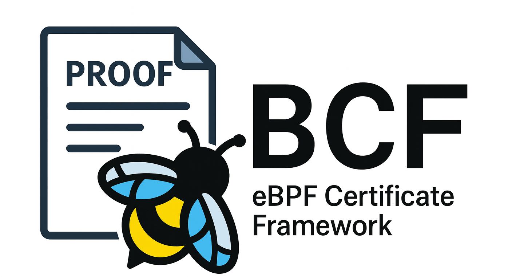

<p align="center">
  <br>
</p>
<h2 align="center" style="margin-top: -20px;">eBPF Certificate Framework</h2>


BCF is a framework that enhances the eBPF verifier's precision via proof-guided abstraction refinement. It enables the verifier to achieve high precision through user-space reasoning while maintaining soundness through formal proof checking. BCF addresses the precision limitations by:

- **Refinement**: Making the verifier's knowledge about program state more precise
- **Delegation**: Delegating refinement reasoning to user space (low kernel complexity)
- **Proof**: Requiring formal proofs that are validated by an in-kernel proof checker

*NOTE*: This branch is **deprecated**; please refer to the [main](https://github.com/SunHao-0/BCF) branch for the latest implementation.

## Project Structure

```
├── patches-kernel/     # Kernel patches for BCF integration
├── patches-loader/     # User-space loader (bpftool) patches
├── patches-solver/     # SMT solver (cvc5) patches for proof generation
├── bcf-checker/        # Standalone proof checker (user-space port)
├── bpf-progs/          # eBPF programs for evaluation
├── scripts/            # Build and evaluation scripts
├── build/              # Build artifacts (generated)
└── output/             # Results and binaries (generated)
```

## Key Components

### BCF Operation Flow

1. **Verification Halt**: The eBPF verifier encounters a verification error
2. **State Capture**: BCF backtracks and captures program state and path constraints
3. **Refinement Generation**: The verifier's abstraction is refined with a soundness condition
4. **User-Space Delegation**: The condition is passed to user space for reasoning
5. **Proof Generation**: User space produces a formal proof using the SMT solver
6. **Proof Validation**: The kernel BCF proof checker validates the proof
7. **Continuation**: If valid, verification continues with refined abstraction

### 1. Kernel Integration (`patches-kernel/`)

See [the patch cover letter](patches-kernel/0000-cover-letter.patch) for more details.

- Adds BCF expression and formula definitions to the kernel
- Implements state tracking and path constraint collection
- Integrates the BCF proof checker for soundness validation
- Enables on-demand abstraction refinement

### 2. User-Space Loader (`patches-loader/`)

See [the patch cover letter](patches-loader/0000-cover-letter.patch) for more details.

- Modifies bpftool to detect refinement conditions
- Converts conditions to SMT-LIB format
- Bridges kernel verifier and user-space solver
- Drives the refinement-solving loop

### 3. SMT Solver (`patches-solver/`)
- Patches cvc5 to emit proofs in BCF binary format
- Handles QF_BV formulas for refinement conditions
- Produces refutation proofs for UNSAT cases

### 4. Proof Checker (`bcf-checker/`)

Please refer to [bcf-checker/README.md](bcf-checker/README.md) for more details about the design and the BCF proof format.

- Standalone user-space port of the kernel proof checker
- Validates BCF format proofs
- Supports development and testing of proof tools

## Prerequisites

- Linux environment (tested on Debian Bookworm)
- QEMU with KVM support
- [virtiofsd](https://gitlab.com/virtio-fs/virtiofsd) for file sharing
- Standard build tools (make, gcc/clang, git)
- Python3 with standard libraries

First, download the disk image (`bookworm.img`) following the instructions in [imgs/README.md](imgs/README.md). The image is used to boot the modified kernel and run all the evaluation scripts.

Next, use the following script to install most of the dependencies for the project automatically. The script should be run as non-root, but with sudo privileges to install packages.

```bash
./scripts/install-deps.sh
```

## Quick Start

Please refer to the [scripts/README.md](scripts/README.md) for more details.

### Build the System
```bash
./scripts/build.sh all
```

This will:
- Download, patch, and build the Linux kernel
- Download, patch, and build the cvc5 solver with BCF proof support
- Compile the modified bpftool loader
- Install the kernel image, tools, libs to the output directory (default: `output/`)

### Run Evaluation
The following script will run the evaluation automatically. It will:
- Boot the modified kernel using QEMU, and share the current directory to the guest VM
- Run the loading script to load the programs with BCF enhanced verifier (`--run-load`)
- Run the benchmarks, e.g., benchmark load time (`--run-bench`)
- Collect the results in the output directory (default: `output/`)
- Analyze the results and generate plots (`--analyze`)

```bash
# Run load experiments
./scripts/run_exp.sh --run-load

# Run benchmarks, e.g., benchmark load time
./scripts/run_exp.sh --run-bench

# Analyze results
./scripts/run_exp.sh --analyze
```

The evaluation script (`scripts/load_prog.py`) performs the following steps:

1. **Program Loading**: Attempts to load eBPF programs using the modified bpftool
2. **BCF Integration**: When verification fails, BCF automatically engages
3. **Proof Generation**: cvc5 generates proofs for refinement conditions
4. **Result Collection**: Records success/failure rates and performance metrics

The evaluation uses structured program indices:
- `prog_index.json`: Program metadata and grouping
- `obj_prog_type.json`: Program type information
- `accepted_prog_index.json`: Successfully loaded programs

Results are stored in `output/` with the following structure:
- `load.log`: Detailed loading process log
- `vm.log`: Virtual machine operation log
- `calico/`, `cilium/`: Project-specific results
- Performance metrics and success rates

Use `scripts/process_bcf_result.py` to analyze results:
```bash
./scripts/process_bcf_result.py --output_dir output/ -p bpf-progs/
```

After executing everything, the analysis automatically produces: (1) the acceptance details, matching the results in Section 6.2, (2) a detailed table shown the component-wise evaluation results, matching Table 2 in Section 6.3, and (3) various plots (`*.pdf`) matching Figure 8 and other results in the paper.

## License

This project is licensed under GPL-2.0.

## Citation

If you use this artifact in your research, please cite the corresponding SOSP paper.

```
@inproceedings {haosun-sosp25,
author = {Hao Sun and Zhendong Su},
title = {Prove It to the Kernel: Precise Extension Analysis via Proof-Guided Abstraction Refinement},
booktitle = {In Proceedings of SOSP, Seoul, Korea, October 13-16, 2025},
year = {2025},
publisher = {Association for Computing Machinery},
address = {Seoul, Korea},
month = oct
}
```
